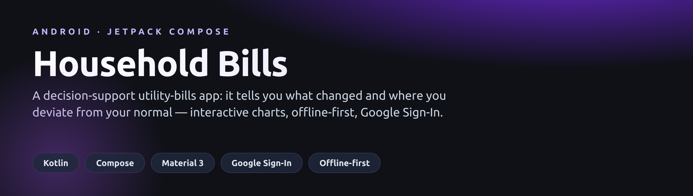
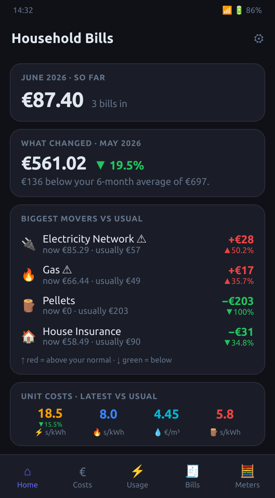
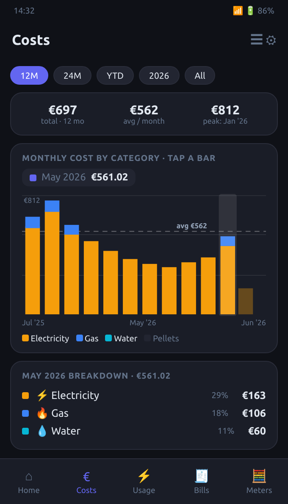
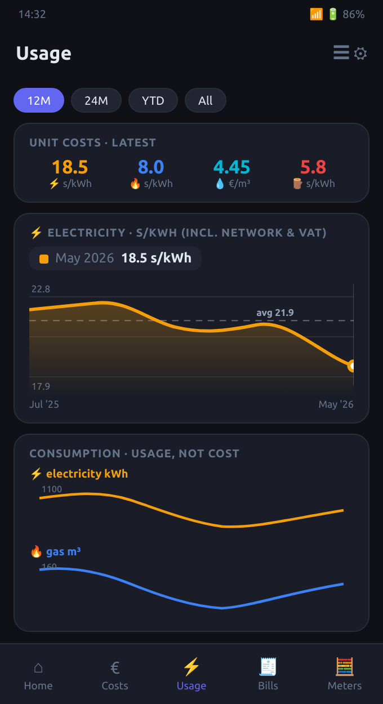
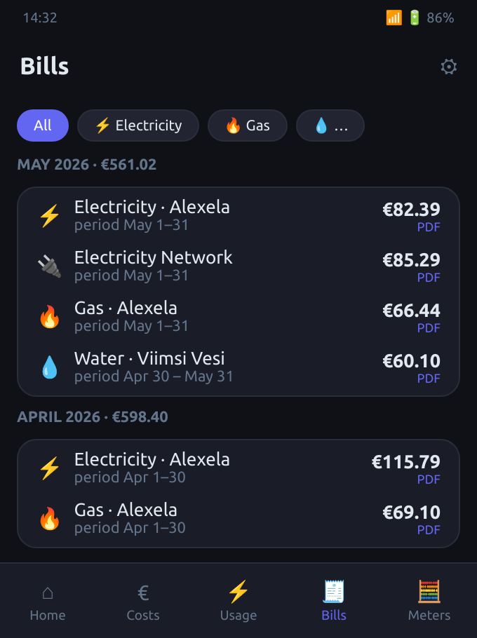
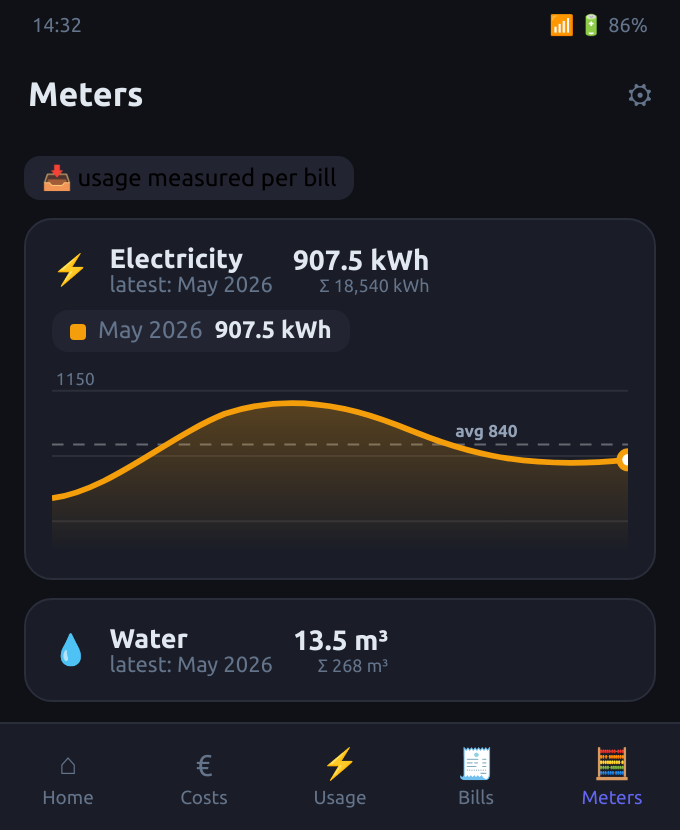
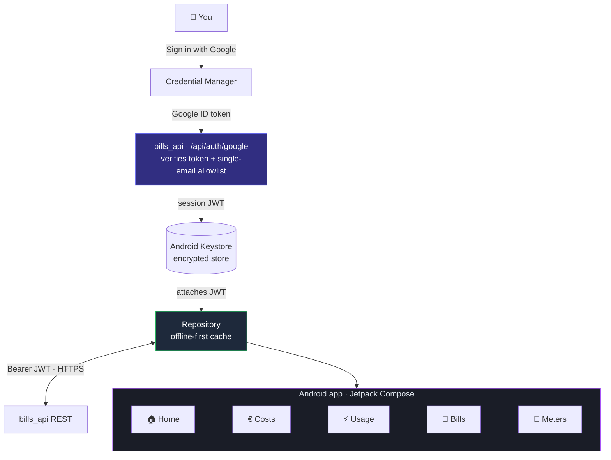

<p align="center">
  
</p>

<p align="center">
  A native Android companion for a self-hosted <b>utility-bills pipeline</b> — it doesn't
  just display the numbers, it helps you decide: surfacing <b>what changed</b>, which
  categories drifted from their normal, and whether your <b>unit rates</b> are climbing.
  Single-device, Google Sign-In, fully offline-capable.
</p>

<p align="center">
  
  
  
  
  
</p>

## Screens

<table>
  <tr>
    <td align="center"><br><sub><b>Home</b> · what changed &amp; biggest movers</sub></td>
    <td align="center"><br><sub><b>Costs</b> · bars, drill-down, presets</sub></td>
    <td align="center"><br><sub><b>Usage</b> · unit costs, scale &amp; average</sub></td>
  </tr>
  <tr>
    <td align="center"><br><sub><b>Bills</b> · grouped by attributed month</sub></td>
    <td align="center"><br><sub><b>Meters</b> · usage from each bill</sub></td>
    <td align="center"><sub>📄 One-page overview:<br><a href="Household-Bills-App-Overview.pdf">App-Overview.pdf</a></sub></td>
  </tr>
</table>

## What makes it useful

- **Decision support, not a read-out.** The Home screen leads with *What changed*
  (the latest complete month against its trailing six-month baseline, in plain
  language) and *Biggest movers* (each category vs its own normal — red above,
  green below, ⚠ on genuine spikes). Unit costs show their trend vs the 6-month
  average, so a tariff drift is obvious.
- **Readable, interactive charts.** A hand-built Compose-Canvas kit: smooth
  animated lines with gradient fills, rounded animated bars, **Y-axis value
  labels**, a dashed **average reference line** so deviations read against
  "normal", and tap-to-select with a value pill. Tap a Costs bar to drill into
  that month's breakdown.
- **Comfortable filtering.** One-tap range presets (12M / 24M / YTD / year / All)
  always visible, a tappable legend to toggle categories, and a range-summary
  card (total / avg-per-month / peak). Filtering is client-side and instant.
- **Correct by construction.** Cost-month attribution and the accrual clip
  (annual insurance spread monthly, pellets over the heating season) live in one
  shared module on the server, so the app's numbers always match the web
  dashboard. A transport bill invoiced in June for May service is shown under May.
- **Offline-first.** Every screen renders cached data with a "last synced"
  banner when the server is unreachable — never a blocking error.

## Architecture



- **App:** Kotlin · Jetpack Compose · Material 3 (dark). `minSdk 33`, `arm64-v8a`.
- **Networking:** Retrofit + kotlinx-serialization over HTTPS.
- **Auth:** *Sign in with Google* via Credential Manager → the server verifies the
  Google ID token and accepts exactly one allowlisted email, then issues a session
  JWT stored in `EncryptedSharedPreferences` (Android Keystore).
- **Charts:** no third-party chart library — drawn on Compose `Canvas`.

### Server contract

| Endpoint | Purpose |
|---|---|
| `POST /api/auth/google` | Exchange a Google ID token for a session JWT (single-email allowlist) |
| `GET /api/bills/summary` | Home screen: KPIs, deviations vs baseline, latest unit costs |
| `GET /api/bills/series` | Full monthly aggregates for Costs & Usage (sliced client-side) |
| `GET /api/bills` | Bills list, each stamped with its attributed `cost_month` |
| `GET /api/meter-readings` | Per-period usage |

All `/api/*` routes accept the Bearer session JWT (or an internal API key for
server-side callers).

## Build

A single `build.sh` builds a signed release APK inside a throttled, transient
container (no Android Studio required on the host):

```bash
./build.sh keystore   # one-time: generate signing key, print its SHA-1
./build.sh            # build → dist/household-bills-YYYYMMDD.apk
```

The signing keystore and its password live under `keystore/` and are **git-ignored** —
the key is the app's identity; never commit it.

## Google Cloud setup (one-time)

In the Google Cloud Console:

1. **OAuth consent screen** — External, *In production*; scopes `openid email`
   (non-sensitive, so no verification review).
2. **OAuth client → Android** — your package name + the release keystore SHA-1
   (from `./build.sh keystore`).
3. **OAuth client → Web** — its client ID is the audience the server verifies.
   Put it in the server's environment and paste the same ID into the app's
   **Settings**.

## Configuration

On first run, open **Settings** and set your server URL and the Google Web client
ID. Nothing host-specific is hard-coded.

## License

[MIT](LICENSE) © 2026 Arut-A
